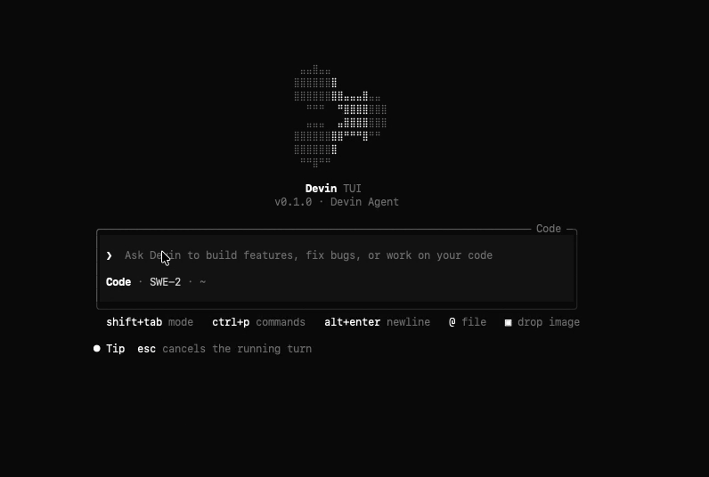
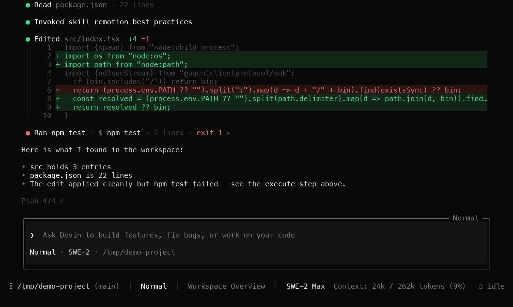

# devin-tui



A custom full-screen terminal UI for Devin, driven by `devin acp` (Agent Client
Protocol — JSON-RPC over stdio). React + Ink, black & white.

> Unofficial — not affiliated with or endorsed by Cognition. "Devin" and the
> Devin logo are trademarks of Cognition.

### Sessions

Tool calls, inline diffs, collapsible command output, the plan and a status
bar with folder, branch, model and context usage — plus per-session spend,
computed from Devin's own per-turn token counts (`_cognition.ai/turn_stats`)
× catalog prices; `/status` shows the breakdown:



## Requirements

- macOS or Linux
- Node.js ≥ 22
- The [Devin CLI](https://docs.devin.ai/cli) installed and signed in —
  `devin` must be on `PATH` (or in `~/.local/bin`)

## Install

```sh
git clone https://github.com/fenner888/devin-tui.git && cd devin-tui
npm install
npm link          # exposes `devin-tui` on PATH
```

Optional zsh/bash shortcut so `devin tui` launches it:

```sh
devin() {
  if [ "$1" = "tui" ]; then
    shift
    command devin-tui "$@"
  else
    command devin "$@"
  fi
}
```

## Usage

```sh
devin-tui                        # launch in the current directory
devin-tui --cwd /some/dir        # session working directory
devin-tui --model <name>         # passed through to devin acp --model
devin-tui -c | --continue        # resume the newest session in this cwd
devin-tui -r <id> | --resume <id>  # load a specific session id
devin-tui --agent "<cmd>"        # spawn a different ACP agent command
```

The first launch asks you to sign in — it runs the Devin CLI's browser-based
auth flow; there is no API-key prompt.

### Slash commands

`/model` model picker (per-model reasoning levels + pricing) · `/fusion`
Fusion lead+sidekick picker · `/resume` session picker · `/handoff [task]`
hand off to a cloud Devin · `/help` help overlay · `/login` re-authenticate ·
`/logout` sign out · `/status` session/account line · `/clear` new session ·
`/sidebar` toggle the plan block · `/exit` (or `/quit`) quit — bare `quit` /
`exit` also work, like the Devin CLI.

### Keys

`shift+tab` cycle mode · `ctrl+p` command panel · `ctrl+o` expand/collapse
command blocks · `ctrl+b` toggle plan block · `esc` close overlays / twice
within 1.5s interrupts a turn · `ctrl+c` twice quits · `enter` send ·
`alt+enter` or `ctrl+j` newline in the composer · `@` file mentions · pasting
or typing an image path attaches it · in pickers `↑↓` select, `←→` adjust the
row's control (reasoning effort / sidekick), `/` + typing filters.

### `/handoff`

Requires a Personal Access Token: create one at
app.devin.ai → Settings → Devin API → PATs, then export:

```sh
export DEVIN_API_KEY=cog_…     # your PAT
export DEVIN_ORG_ID=org-…      # your organization id (needed for cog_ keys)
```

### Model pricing

Prices and `✱ New`/`✱ Beta` badges in `/model` come from
`devin models list --format json`, cached to `~/.cache/devin-tui/models.json`
and refreshed on each start. If the CLI isn't signed in, the picker still
works — pricing just stays hidden.

## Updating

```sh
cd devin-tui && git pull && npm install
```

No re-link is needed — `devin-tui` on PATH points at the clone. The TUI
shows a notice in the corner/status bar when a newer version is published
(checked at most once per 24 h, cached in `~/.cache/devin-tui/`); set
`DEVIN_TUI_NO_UPDATE_CHECK=1` to disable it.

### Compatibility with Devin CLI updates

The TUI spawns whatever `devin` is installed, so `devin update` is picked up
automatically — models, commands, modes and reasoning levels all come from
Devin at runtime, not from this repo. If a Devin release changes payload
shapes, some rows may render more plainly until the TUI is updated. Tested
with Devin CLI `3000.11.3` (ACP protocol v1). After a Devin update you can
run:

```sh
npx tsx scripts/check-real-devin.ts
```

which verifies the ACP handshake against the installed CLI (initialize,
auth-required `session/new`, extension-notification resilience) without
authenticating — and open an issue if something looks off.

### Releasing (maintainer)

Bump `version` in `package.json`, commit, then:

```sh
git tag vX.Y.Z && git push --follow-tags
```

The version bump on `main` is what triggers users' update notice.

## Troubleshooting

- Agent stderr and app diagnostics append to `$TMPDIR/devin-tui/devin-acp.log`
  (rotated to `devin-acp.log.1` when it exceeds 5 MB). It is never written to
  the terminal.
- Set `DEVIN_TUI_DEBUG=1` to additionally capture protocol payloads:
  `session-updates.jsonl`, `session-config.json` and `config-updates.jsonl`
  in `$TMPDIR/devin-tui/`. **These contain session content** (file contents,
  command output) — they're off by default. Authentication payloads are never
  written.

## Development

```sh
npm run typecheck                                   # tsc --noEmit
npm start -- --agent "npx tsx test/fake-agent.ts"   # fake Devin, no login
python3 scripts/drive.py 120 36 out.raw <scenario>  # PTY driver
npx tsx scripts/snapshot.ts out.raw                 # ANSI → text
python3 scripts/render-png.py out.raw --out shot.png  # ANSI → PNG
```

The Python scripts need Python 3; `render-png.py` additionally needs Pillow
(`pip3 install Pillow`). See `specs/devin-tui.md` for the full behavior spec
and `AGENTS.md` for design rules.

## License

MIT — see [LICENSE](LICENSE).
